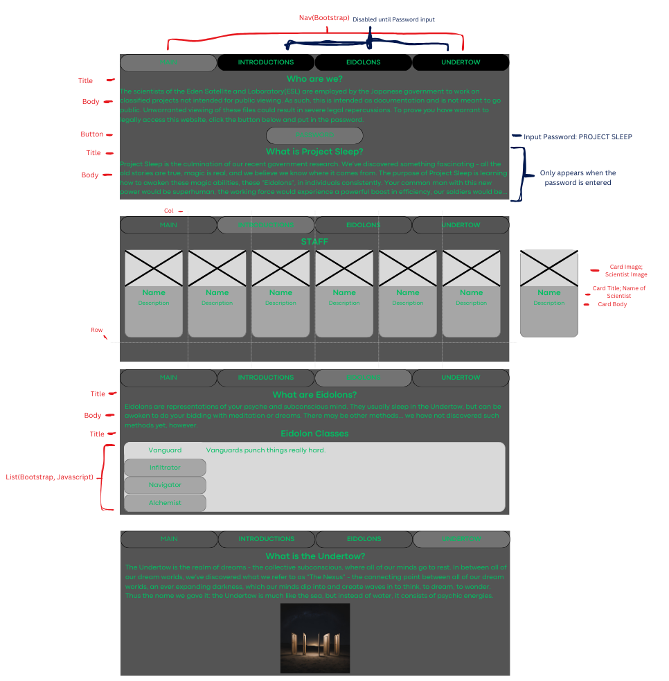

# Capstone Project

## About

This website is based on my Eidolon campaign "Eidoloid: Project Sleep", intended to be in-universe representation of the titular project the scientists in the lore of the game were working on, studying Eidolons and the Undertow.

## Built with

* Bootstrap
* CSS
* HTML
* Javascript

## Roadmap

- [ ] Work on HTML for Main
- [ ] Work on Bootstrap, CSS, and Javascript for Main
- [ ] Work on Introductions
- [ ] Work on Eidolons
- [ ] Work on Undertow
- [ ] Finalize, get everything looking right!

## Wireframe

## Contact

Joshua Wood: ThePromiseIncarnate@gmail.com

## Acknowledgements

* Canva's AI Tool
* Luke Varner and Molly Rhinebeck for Eidolon 2e: Become Your Best Self
* [w3schools Cards](https://www.w3schools.com/bootstrap5/bootstrap_cards.php)
* [w3schools Navs](https://www.w3schools.com/bootstrap5/bootstrap_navs.php)
* [w3schools For Loops](https://www.w3schools.com/js/js_loop_for.asp)
